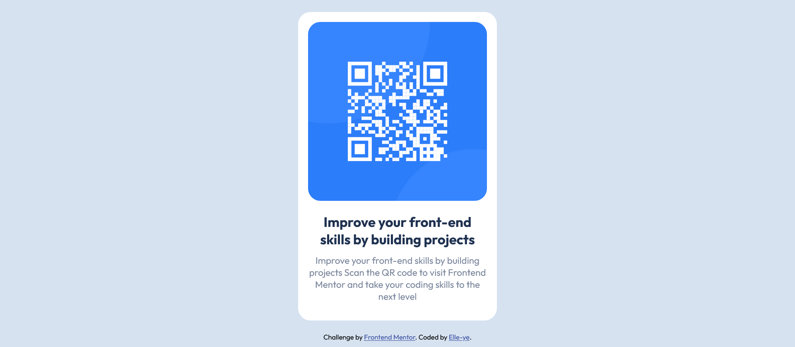

# Frontend Mentor - QR code component solution

This is a solution to the [QR code component challenge on Frontend Mentor](https://www.frontendmentor.io/challenges/qr-code-component-iux_sIO_H). Frontend Mentor challenges help you improve your coding skills by building realistic projects. 

## Table of contents

- [Overview](#overview)
  - [Screenshot](#screenshot)
  - [Links](#links)
- [My process](#my-process)
  - [Built with](#built-with)
  - [What I learned](#what-i-learned)
  - [Continued development](#continued-development)
  - [Useful resources](#useful-resources)
- [Author](#author)
- [Acknowledgments](#acknowledgments)

**Note: Delete this note and update the table of contents based on what sections you keep.**

## Overview

### Screenshot

### Links

- Solution URL: [Add solution URL here](https://your-solution-url.com)
- Live Site URL: [Add live site URL here](https://your-live-site-url.com)

## My process

### Built with

- Semantic HTML5 markup
- CSS custom properties
- Flexbox
- Mobile-first workflow

### What I learned

I struggled quite a bit with the positioning of the body.  The body was refusing to take up the 100% height I gave it. The bottom portion of screen was being taken up something I couldn't see.
I finally found the solution. Use view-width (vw) and view-height(vh) instead of percentage. The main content was still not centering properly tho (with margin: auto).
Figured out margin: auto only works for centering items horizontally. So I used flexbox for the vertical centering.

### Continued development

I definitely need to work on positioning of items. With focus on flexbox and grid.

### Useful resources

- [Example resource 1](https://www.google.com) - I searched on Google to find the explanation for why margin: auto doesn't center items vertically.

## Author

- Website - [Elle-ye](https://www.your-site.com)
- Frontend Mentor - [@Elle-ye](https://www.frontendmentor.io/profile/elle-ye)

